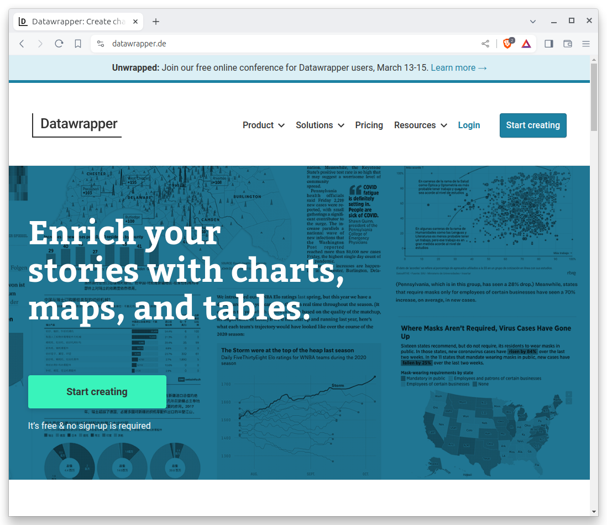
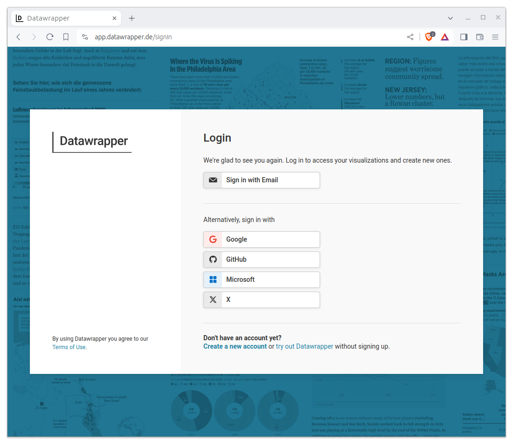
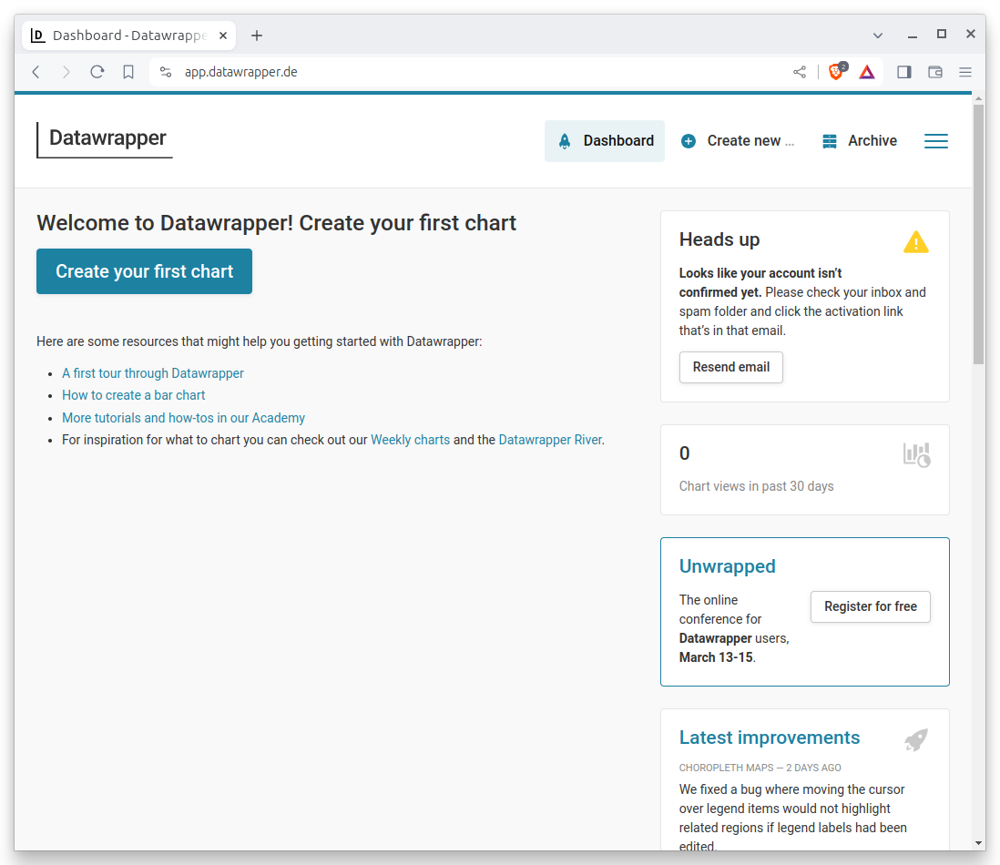
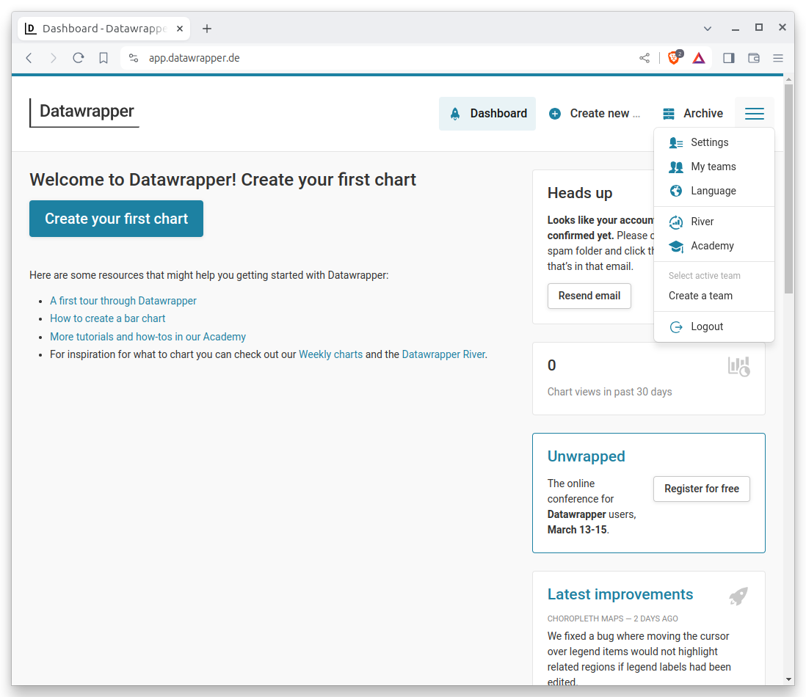
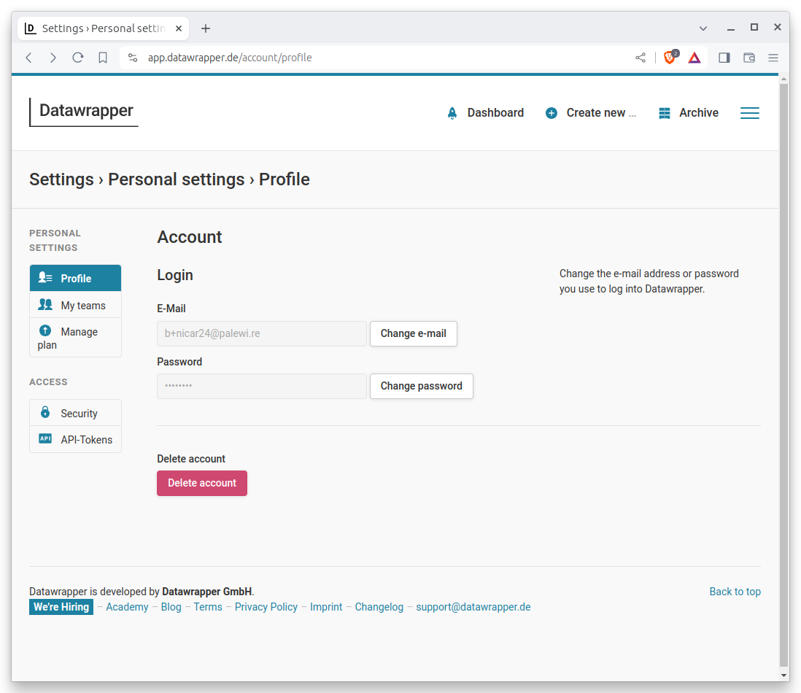
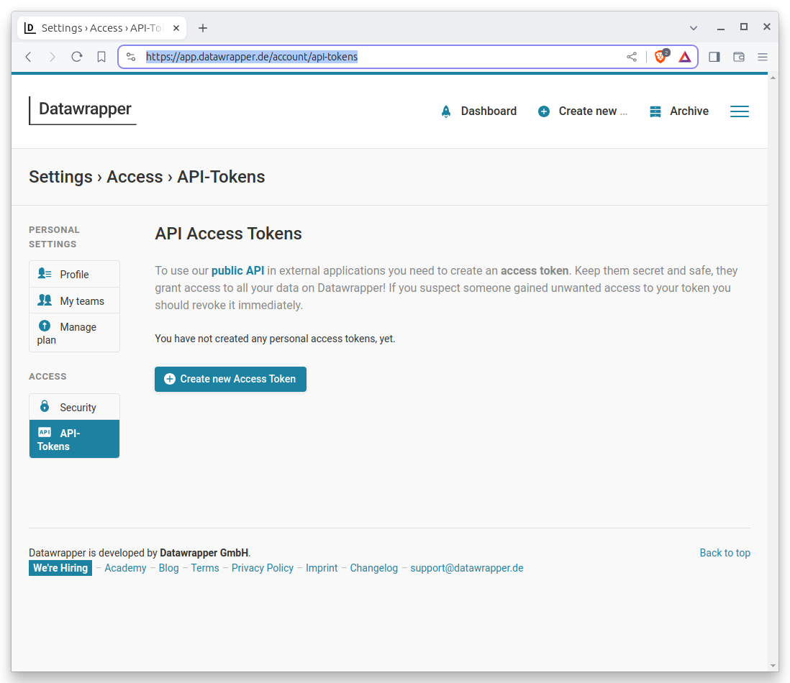
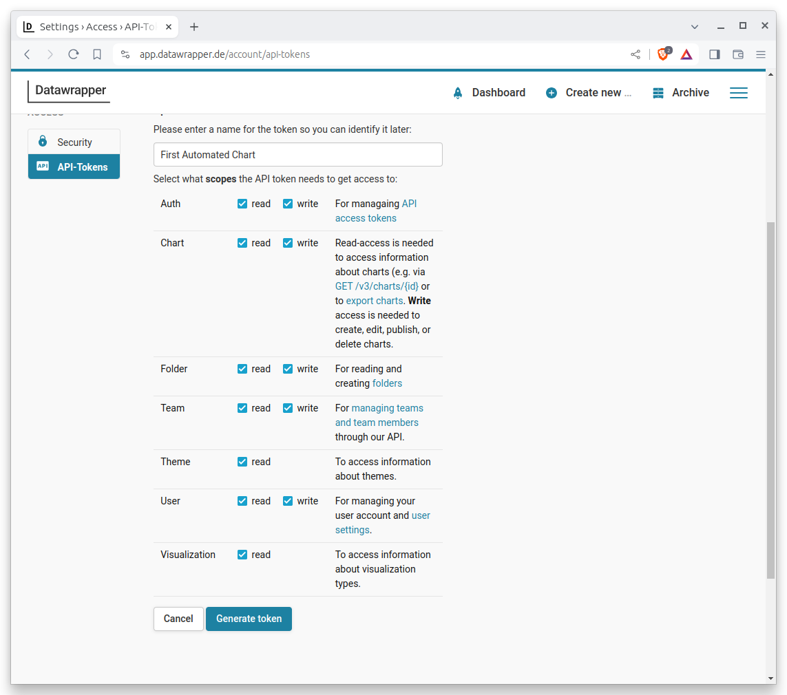
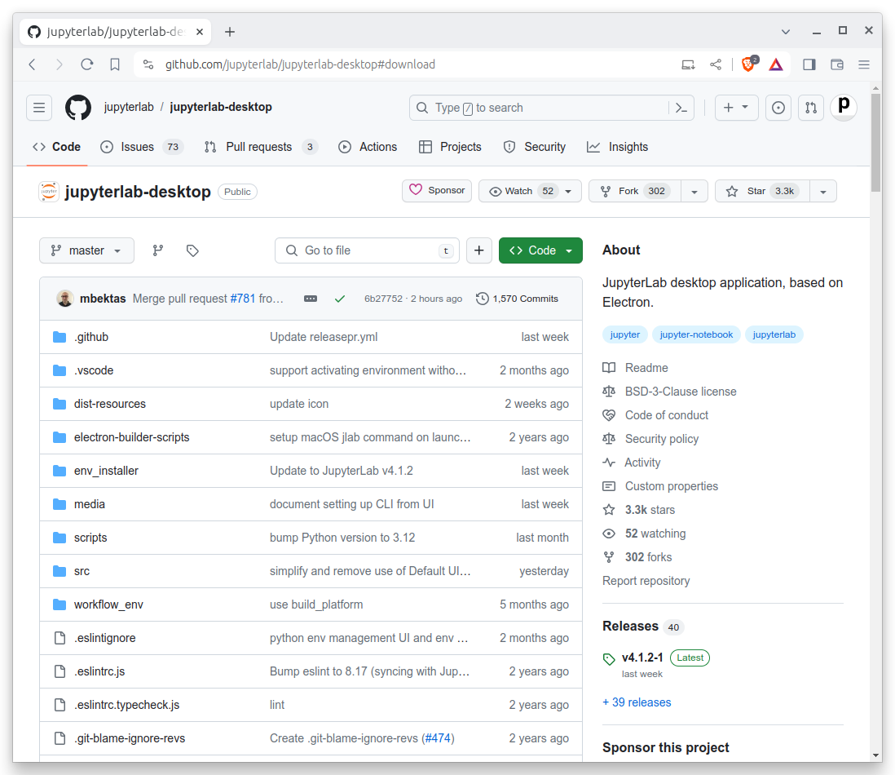
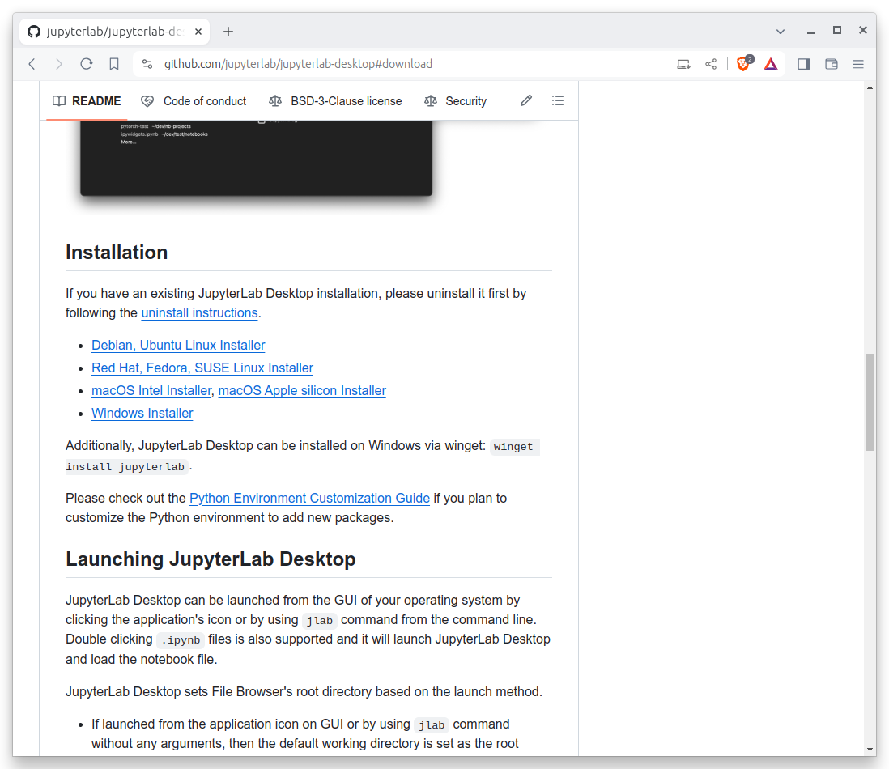
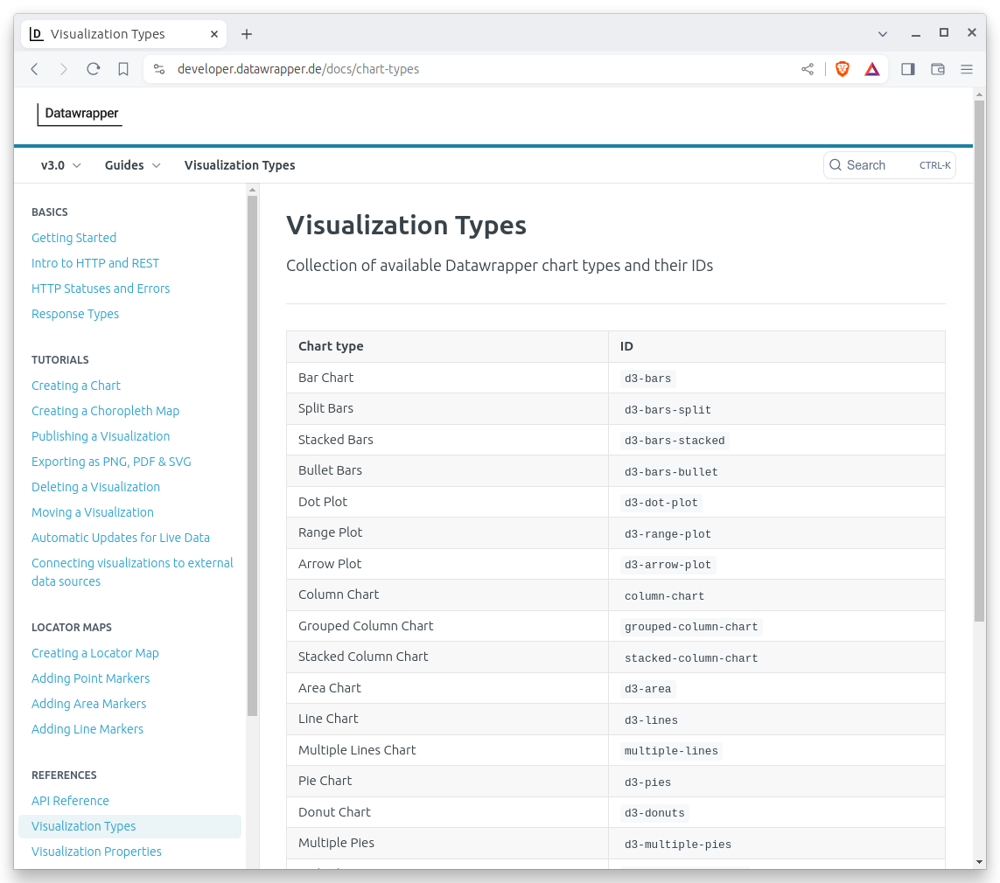

# First Automated Chart

Learn how you can use [Python](https://www.python.org/) and the [Datawrapper](https://developer.datawrapper.de/docs/getting-started) API to create a limitless number of charts.

## What this class covers

* How to create an key that allows you to edit charts using the Datawrapper API
* How to use a Jupyter notebook and the Python `datawrapper` library to create a chart
* How to write a template function that creates a chart for each item in a list
* How to create a chart that updates on a schedule 

## What you need

If you've brave enough to give the Python programming language a try, you can learn something. You'll need some Python experience to get very far creating charts of your own, but the materials below can help anyone understand what's possible.

## Table of contents

* [Create a Datawrapper API key](#create-a-datawrapper-api-key)
* [Getting started with Project Jupyter](#getting-started-with-project-jupyter)
* [Connect to the Datawrapper API](#connect-to-the-datawrapper-api)
* [Import data](#import-data)
* [Create one chart](#create-one-chart)
* [Create many charts](#create-many-charts)
* [Create a scheduled chart](#create-a-chart-that-runs-on-a-schedule)

## Create a Datawrapper API key

The first step is to create an API key that will allow you to create and edit charts using the Datawrapper API. This is a simple process that can be done in a few clicks. It all begins at the Datawrapper homepage at [datawrapper.de](https://www.datawrapper.de/).

[](https://www.datawrapper.de/)

Hit the "Login" button in the upper right corner of the screen.



If you already have an account, enter your email and password to log in. If you don't, click the "Create a new account" button at the bottom of the form. If you m ake a new account, be sure to confirm your email address when Datawrapper sends you a message.

Once you are logged in, you should see a page that looks like this:



Hover on the menu icon in the upper right corner of the screen and click "Settings."



That will drop you on the setting page. Here you want to click on the "API Tokens" link in the left-hand navigation.



```{note}
If you made a new account and haven't confirmed your email address, you will see an error message. Check your email for a message from Datawrapper and click the link to confirm your account.
```

On the next page, hit the "Create new Access Token" button.



That will bring up a form. You should give your token a name that will help you remember what it's for. For instance, you might call it "First Automated Chart." Then click all of the permissions checkboxes. This will allow your token to do everything it needs to do. Then hit the "Generate token" button at the bottom.



That will bring you to a new page with your token printed in the middle. It will look something like the following, though I have redacted the actual token for security reasons. You should copy this token and save it in a safe place. It is the key you will need to use the Datawrapper API.


## Getting started with Project Jupyter

A [Jupyter notebook](http://jupyter.org/) is a browser-based interface where you can write, run, remix and republish code.

It is free software you can install and run like any other open-source library. It is used by scientists, scholars, investors and corporations to create and share their research. It is also used by journalists to develop stories and show their work.

There are numerous ways to install and configure Jupyter notebooks. Since this tutorial is designed for beginners, it will demonstrate how to use [JupyterLab Desktop](https://github.com/jupyterlab/jupyterlab-desktop), a self-contained application that provides a ready-to-use Python environment with several popular libraries bundled in. It can be installed on any operating system with a simple point-and-click interface.

The first step is to visit [JupyterLab Desktop’s homepage on GitHub](https://github.com/jupyterlab/jupyterlab-desktop) in your web browser.

[]((https://github.com/jupyterlab/jupyterlab-desktop))

Scroll down to the documentation below the code until you reach the Installation section.



Then pick the link appropriate for your operating system. The installation file is large so the download might take a while.

Find the file in your downloads directory and double click it to begin the installation process. Follow the instructions presented by the pop-up windows, sticking to the default options.

```{note}
Your computer’s operating system might flag the JupyterLab Desktop installer as an unverified or insecure application. Don’t worry. The tool has been vetted by Project Jupyter’s core developers and it’s safe to use.

If your system is blocking you from installing the tool, you’ll likely need to work around its barriers. For instance, on MacOS, this might require visiting your system’s security settings to allow the installation.
```

Once the program is installed, you can accept the installation wizard’s offer to immediately open the program, or you can search for “Jupyter Lab” in your operating system’s application finder.

That will open up a new window that looks something like this:


Now click the "New notebook..." button to open the Python interface. It will open up the notebook with an empty cell, which is where you can write and run your code.


The remainder of this class will assume you know how to enter code into cells and execute them in the notebook. If you don't, don't worry. It's very easy. You can quickly learn how by working through the introductory chapter of ["First Python Notebook"](https://palewi.re/docs/first-python-notebook/notebook.html), another open-source course available on this site.

From here on out, you can follow along with the code examples in this notebook. You can also copy and paste the code into your own notebook and run it there.

## Connect to the Datawrapper API

The `datawrapper` Python library, created by the authors of this class, is a simple tool that allows you to interact with the Datawrapper API using Python. It is available for free on the [Python Package Index](https://pypi.org/project/datawrapper/), a repository of open-source software that can be installed in your Jupyter Desktop environment with a single command in the first cell.

```bash
!pip install git+https://github.com/chekos/Datawrapper.git#egg=datawrapper
```

Once that's installed, you can import it into your notebook.

```python
from datawrapper import Datawrapper
```

The key first step is to authenticate with the Datawrapper API using the token you created earlier. You can do that by creating a new `Datawrapper` object and passing your token to it. We will save that as a variable named `dw`.

```python
dw = Datawrapper("YOUR ACCESS TOKEN")
```

We can verify that our connection is working by asking the `dw` object to tell us about the account.

```python
dw.get_my_account()
```

It should return a dictionary with information about the account, including the user's email address and role. It will look something like this:

```python
{'id': 696724,
 'email': 'b+nicar24@palewi.re',
 'name': None,
 'role': 'editor',
 'language': 'en-US',
 'presenceColor': None,
 'avatar': None,
 'teams': [],
 'chartCount': 0,
 'url': '/v3/users/696724',
 'entitlements': {}}
```

If an error appears, you'll need to verify that you have entered your token correctly. If you are sure you have, you might need to check that your token has the correct permissions. It should have all of the permissions checked when you created it.

## Import data

Now that we're connected to Datawrapper, it's time to introduct the data that we'll use to create our charts. We'll use a dataset of arrests in Baltimore, Maryland, that is available [on the city's data portal](https://data.baltimorecity.gov/datasets/baltimore::bpd-arrests/about). To speed up the class, we've created [a simplified version](https://raw.githubusercontent.com/palewire/first-automated-chart/main/_notebooks/arrests.csv) for use here.

We'll read in the data using the `pandas` library, which is a popular tool for working with data in Python. Before you can use it, you'll need to install it in your Jupyter Desktop environment using the same technique you used to install the `datawrapper` library.

```bash
!pip install pandas
```

Now it can be imported into your notebook.

```python
import pandas as pd
```

We'll read in the data using the `read_csv` function and save it as a variable named `df`.

```python
df = pd.read_csv(
    "https://raw.githubusercontent.com/palewire/first-automated-chart/main/_notebooks/arrests.csv",
    parse_dates=["ArrestDateTime"]
)
```

That can be inspected by running the `head` method on the `df` object, which will show the first five rows.

```python
df.head()
```

You can see that the dataset features one row for each arrest, with columns for the date and time of the arrest, the district where it occurred and the charge that was filed.

## Create one chart

With these materials, any number of charts could be created. As a simple start, lets consider a chart that shows the number of arrests in Baltimore by year. We could look into the idea by creating a new column in the `df` object that contains the year of each arrest.

```python
df['year'] = df.ArrestDateTime.dt.year
```

And then we could count the tally of arrests in each year.

```python
df.year.value_counts()
```

That will return some eye-opening numbers. It looks like the number of arrests in Baltimore has been falling over the years, exactly the kind of thing we might want to visualize with a chart.

```python
2010    45224
2011    43364
2012    42333
2013    39542
2014    37078
2015    25732
2016    23089
2017    21989
2018    20543
2019    19407
2023    13566
2020    13162
2022    12360
2021    11130
Name: year, dtype: int64
```

Before we can pass our data into Datawrapper, we need to reshape it into a pandas DataFrame, the kind of data structure that our Python library expects. We can do that by calling the `sort_index` and `reset_index` methods on the end of the `value_counts` method.

```python
totals_by_year = df.year.value_counts().sort_index().reset_index()
```

That should output a tidy table that's ready for the API. The only other things you need to make a basic chart are a title and a chart type. You can write whatever headline you like, but every chart type has a strict code name that you can find in the [Datawrapper documentation](https://developer.datawrapper.de/docs/chart-types).

[](https://developer.datawrapper.de/docs/chart-types)

In this case, the data seems well suit for a column chart, with one vertical bar for each year's arrest total. The documentation tells us that the code for that is "column-chart."

Connecting to the API and creating your first chart is as simple as passing our three required inputs — a headline, a chart type and a DataFrame — into the `create_chart` method of the `dw` object.

That can be done with the following code. While it's not required, we'll save the result as a variable named `chart_config` so that we can reuse what it returns.

```python
chart_config = dw.create_chart(
    title="Baltimore Arrests",
    chart_type="column-chart",
    data=totals_by_year
)
```

If the cell runs without error, a new chart is born. You can see it by visiting [https://app.datawrapper.de/](https://https://app.datawrapper.de/) in your logged in browser.


Congratulations! You've created your first chart using the Datawrapper API. While it's ready for review in the dashboard, it won't be published by default. Let's learn how to do that next.

Back in our notebook, the method returned a dictionary with information about the chart that was created. You can inspect it by running the variable name in a new cell.

```python
chart_config
```

It should spit out a dictionary with a ton of metadata about your chart. The most important bit is the "id" key, which contains the unique identifier for your chart. We can use that to make future edits to the chart. Let's pull it out into a variable named `chart_id`.

```python
chart_id = chart_config["id"]
```

Sending your chart live is as simple as passing the `chart_id` to the `publish_chart` method of the `dw` object, like so:

```python
dw.publish_chart(chart_id)
```

That will make the chart available to the public and return another dictionary of data, which you can ignore.

You can see your handiwork in the notebook by asking the `dw` object to display the chart's embed using the `display_chart` method.

```python
dw.display_chart(chart_id)
```

<iframe title="Baltimore Arrests" aria-label="Column Chart" id="datawrapper-chart-JBvvU" src="https://datawrapper.dwcdn.net/JBvvU/1/" scrolling="no" frameborder="0" style="width: 0; min-width: 100% !important; border: none;" height="400" data-external="1"></iframe><script type="text/javascript">!function(){"use strict";window.addEventListener("message",(function(a){if(void 0!==a.data["datawrapper-height"]){var e=document.querySelectorAll("iframe");for(var t in a.data["datawrapper-height"])for(var r=0;r<e.length;r++)if(e[r].contentWindow===a.source){var i=a.data["datawrapper-height"][t]+"px";e[r].style.height=i}}}))}();
</script>

### Set the chart description

A common practice in data journalism is to provide a citation of the sourcing of the data behind a chart. This is often done in the "Describe" tab of the Datawrapper interface. You can also do it using the `update_description` method of the `dw` object. Here we'll set the source name, source URL and byline.

```python
dw.update_description(
    chart_id,
    source_name="OpenBaltimore",
    source_url="https://data.baltimorecity.gov/datasets/baltimore::bpd-arrests/about",
    byline="First Automated Chart",
)
```

Run that cell and republish your chart.

```python
dw.publish_chart(chart_id)
```

You can see the changes by, again, asking the `dw` object to display the chart's embed.

```python
dw.display_chart(chart_id)
```

<iframe title="Baltimore Arrests" aria-label="Column Chart" id="datawrapper-chart-gX01J" src="https://datawrapper.dwcdn.net/gX01J/2/" scrolling="no" frameborder="0" style="width: 0; min-width: 100% !important; border: none;" height="400" data-external="1"></iframe><script type="text/javascript">!function(){"use strict";window.addEventListener("message",(function(a){if(void 0!==a.data["datawrapper-height"]){var e=document.querySelectorAll("iframe");for(var t in a.data["datawrapper-height"])for(var r=0;r<e.length;r++)if(e[r].contentWindow===a.source){var i=a.data["datawrapper-height"][t]+"px";e[r].style.height=i}}}))}();
</script>

### Style the chart

You can much more than that by using Python to configure the chart's metadata. There are literally dozens of different ways to customize axis labels, annotations, colors, legends, lines, bars and much more. A simple example is to change the color of the bars to match the IRE's accent color.

That can be done by creating a dictionary of metadata to the `metadata` parameter of the `update_chart` method. Here we'll set the "base-color" to the IRE's accent color, which is a nice shade of orange. It must conform precisely with the format expected by Datawrapper's API.

```python
metadata = {
    "visualize": {
        "base-color": "#bf7836"  # IRE's accent color
    }
}
```

That can then be passed to the `update_chart` method of the `dw` object, which will apply the changes to the chart.

```python
dw.update_chart(chart_id, metadata=metadata)
```

Then if you publish the chart...

```python
dw.publish_chart(chart_id)
```

...and display it again...

```python
dw.display_chart(chart_id)
```

...you should see the bars have changed color.

<iframe title="Baltimore Arrests" aria-label="Column Chart" id="datawrapper-chart-0Gjt5" src="https://datawrapper.dwcdn.net/0Gjt5/2/" scrolling="no" frameborder="0" style="width: 0; min-width: 100% !important; border: none;" height="400" data-external="1"></iframe><script type="text/javascript">!function(){"use strict";window.addEventListener("message",(function(a){if(void 0!==a.data["datawrapper-height"]){var e=document.querySelectorAll("iframe");for(var t in a.data["datawrapper-height"])for(var r=0;r<e.length;r++)if(e[r].contentWindow===a.source){var i=a.data["datawrapper-height"][t]+"px";e[r].style.height=i}}}))}();
</script>

## Create many charts

Now on to our next challenge. While using Python to make one chart is a nice trick, it's also pretty easy to do with a mouse and keyboard. One benefit of automating chart creation with Python is that the code you right can be reused to make many charts.

For instance, we could create a chart for each of Baltimore's police districts. Take a look at our sample data again by running the `head` command.

```python
df.head()
```

You'll notice that there is column called District. We can have a closer at what's in it by running the `value_counts` method, just as we did with the year.

```python
df.District.value_counts()
```

That will return tallies like this:

```python
Western      29842
Central      28501
Eastern      28114
Southern     25780
Northeast    24180
Southeast    23710
Northwest    22044
Southwest    21822
Northern     13087
```

We can use a Python to loop through the district and create an annual arrests chart for each one. While there are numerous ways to accomplish this task, for this example we'll write a function that takes the name of a district as an argument and returns a chart. We'll then use a `for` loop to call that function for each district.

Here's a function that does exactly that. We don't have enough time to walk through every step of it, but if you look closely you can see that it's very similar to the code we used to create the first chart. You should copy and paste it into a new cell in your notebook.

```python
def create_chart(district: str) -> str:
    """Create a Datawrapper column chart of arrests by year in a Baltimore police district.
    
    Args:
        district: The name of the district to chart.

    Returns:
        The chart's embed code.
    """
    # Filter the dataframe to the provided district
    district_df = df[df.District == district]

    # Count the number of arrests in each year
    district_by_year = district_df.year.value_counts().sort_index().reset_index()

    # Create the chart with Datawrapper
    chart_config = dw.create_chart(
        # Use the district name in the title
        title=f"Arrests in Baltimore's {district} District",
        # Use the column chart type
        chart_type="column-chart",
        # Pass in the filtered data
        data=district_by_year,
        metadata={
            # Set the bar colors
            "visualize": {
                "base-color": "#bf7836"  # IRE's accent color
            },
            # Set the chart description
            "describe": {
                "source-name": "OpenBaltimore",
                "source-url": "https://data.baltimorecity.gov/datasets/baltimore::bpd-arrests/about",
                "byline": "First Automated Chart"
            }
        }
    )

    # Pull out the chart's unique identifier
    chart_id = chart_config["id"]

    # Publish the chart
    dw.publish_chart(chart_id)

    # Return the chart's embed code
    return dw.display_chart(chart_id)
```

Now all it takes to create a chart is to call the function and pass in the name of a district. For instance, to create a chart for the Western District, you would run the following code:

```python
create_chart("Western")
```

<iframe title="Arrests in Baltimore's Western District" aria-label="Column Chart" id="datawrapper-chart-DX7wA" src="https://datawrapper.dwcdn.net/DX7wA/1/" scrolling="no" frameborder="0" style="width: 0; min-width: 100% !important; border: none;" height="400" data-external="1"></iframe><script type="text/javascript">!function(){"use strict";window.addEventListener("message",(function(a){if(void 0!==a.data["datawrapper-height"]){var e=document.querySelectorAll("iframe");for(var t in a.data["datawrapper-height"])for(var r=0;r<e.length;r++)if(e[r].contentWindow===a.source){var i=a.data["datawrapper-height"][t]+"px";e[r].style.height=i}}}))}();
</script>

And to create a chart for the Eastern District, you would run the following code:

```python
create_chart("Eastern")
```

<iframe title="Arrests in Baltimore's Eastern District" aria-label="Column Chart" id="datawrapper-chart-b9xrP" src="https://datawrapper.dwcdn.net/b9xrP/1/" scrolling="no" frameborder="0" style="width: 0; min-width: 100% !important; border: none;" height="400" data-external="1"></iframe><script type="text/javascript">!function(){"use strict";window.addEventListener("message",(function(a){if(void 0!==a.data["datawrapper-height"]){var e=document.querySelectorAll("iframe");for(var t in a.data["datawrapper-height"])for(var r=0;r<e.length;r++)if(e[r].contentWindow===a.source){var i=a.data["datawrapper-height"][t]+"px";e[r].style.height=i}}}))}();
</script>

Finally, we can loop through the list of unique districts and create a chart for each one. We'll save each chart as a variable in a list so that we can display them all at once. Copy and paste the following code into a new cell in your notebook.

```python
# Create an empty list to hold the charts
chart_list = []

# Loop through the unique districts...
for district in df.District.dropna().unique():
    # Print a message to the console
    print(f"Creating chart for the {district} District")

    # Create a chart for the district and save it as a variable
    c = create_chart(district)

    # Add the chart to the list
    chart_list.append(c)
```

The charts will be created and published in Datawrapper. You can see them all at once in your notebook by introducing the `display` function from the `IPython.display` library.

```python
from IPython.display import display
```

And passing in the list of charts as arguments.

```python
display(*chart_list)
```

Not bad, right! You've just created a dozen charts in a few seconds. You could do the same with an unlimited number of charts, as long as you have the data to supply the API.

## Create a chart that runs on a schedule

That's one example of how Python can supercharge your chart production. Here's another: You can write computer code that, when run on a schedule, will automatically create and publish a chart. This is a powerful way to publish charts whenever new data is available, or to create a series of charts that update on a regular basis.

As an example, let's automate a chart that could be useful to a newsroom. We'll create a chart that shows the top 10 arrest charges in Baltimore over the last week which could, in theory, be published every Monday morning when new data is posted to the city's data portal.

First we'll find the most recent date in our dataset, which will be the end of the week we want to chart. That can be done with pandas by calling the `max` method on the `ArrestDateTime` column.

```python
df.ArrestDateTime.dt.date.max()
```

Let's save that into a variable.

```python
end_date = df.ArrestDateTime.dt.date.max()
```

Then we'll use the `timedelta` class from the `datetime` module to find the date one week before. First we import the tool.

```python
from datetime import timedelta
```

Then we can subtract sevent days from the end date to find the start date.

```python
seven_days_ago = end_date - timedelta(days=7)
```

Filter the dataset to the last week by creating a new DataFrame that only contains the rows where the `ArrestDateTime` is after the start date.

```python
last_week_df = df[df.ArrestDateTime.dt.date > seven_days_ago]
```

We can then count the number of arrests for each charge and save the top 10 as a new DataFrame.

```python
top_charges_df = (
    last_week_df.ChargeDescription.value_counts()  # Count the number of arrests for each charge
        .reset_index()  # Reset the index so that the charge becomes a column
        .head(10)  # Save only the top 10
)
```

Pass that into the `create_chart` method of the `dw` object, just as we did before. This time we'll use the "d3-bars" chart type, which is a nice way to visualize a ranked list of items.

```python
chart_config = dw.create_chart(
    title=f"Top 10 arrest charges in Baltimore last week",
    chart_type="d3-bars",  # Here's that chart type
    data=top_charges_df,  # Note that we're using the top charges DataFrame
    metadata={
        "visualize": {
            "base-color": "#113421",  # Let's do a different color, for fun.
            "thick": True,  # Make the bars thick, another Datawrapper config option
        },
        "describe": {
            "source-name": "OpenBaltimore",
            "source-url": "https://data.baltimorecity.gov/datasets/baltimore::bpd-arrests/about",
            "byline": "Ben Welsh"
        }
    }
)
```

Just as we did with our first chart, we'll grab the identifier.

```python
chart_id = chart_config["id"]
```

Publish it.

```python
dw.publish_chart(chart_id)
```

And display it.

```python
dw.display_chart(chart_id)
```

<iframe title="Top 10 arrest charges in Baltimore last week" aria-label="Bar Chart" id="datawrapper-chart-viAN9" src="https://datawrapper.dwcdn.net/viAN9/1/" scrolling="no" frameborder="0" style="width: 0; min-width: 100% !important; border: none;" height="400" data-external="1"></iframe><script type="text/javascript">!function(){"use strict";window.addEventListener("message",(function(a){if(void 0!==a.data["datawrapper-height"]){var e=document.querySelectorAll("iframe");for(var t in a.data["datawrapper-height"])for(var r=0;r<e.length;r++)if(e[r].contentWindow===a.source){var i=a.data["datawrapper-height"][t]+"px";e[r].style.height=i}}}))}();
</script>

Boom. We're created a little Python routine that, provided with an updated dataset, could be rerun at any time to create a fresh chart.

There are numerous ways you could run such a script according to a schedule, a task beyond the scope of this course. One popular tool is [GitHub Actions](https://docs.github.com/en/actions), a free service linked to GitHub respositories. You can learn how journalists use it to automate data work in our complimentary class [“First GitHub Scraper"](https://palewi.re/docs/first-github-scraper/).

## About this class

This guide was prepared by [Ben Welsh](https://palewi.re/who-is-ben-welsh/) and [Sergio Sanchez Zavala](https://github.com/chekos) for [a training session](https://schedules.ire.org/nicar-2024/index.html#2110) at the National Institute for Computer-Assisted Reporting (NICAR)’s 2024 conference in Baltimore. Some of the copy was written with the assistance of GitHub's Copilot, an AI-powered code completion tool. The materials are available as free and open source on [GitHub](https://github.com/palewire/first-automated-chart)